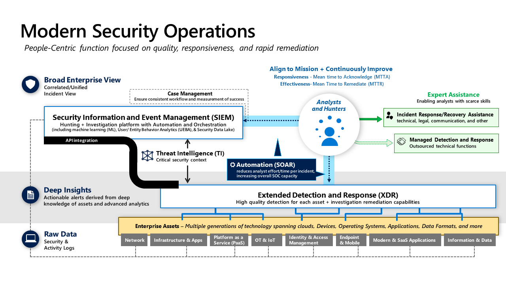
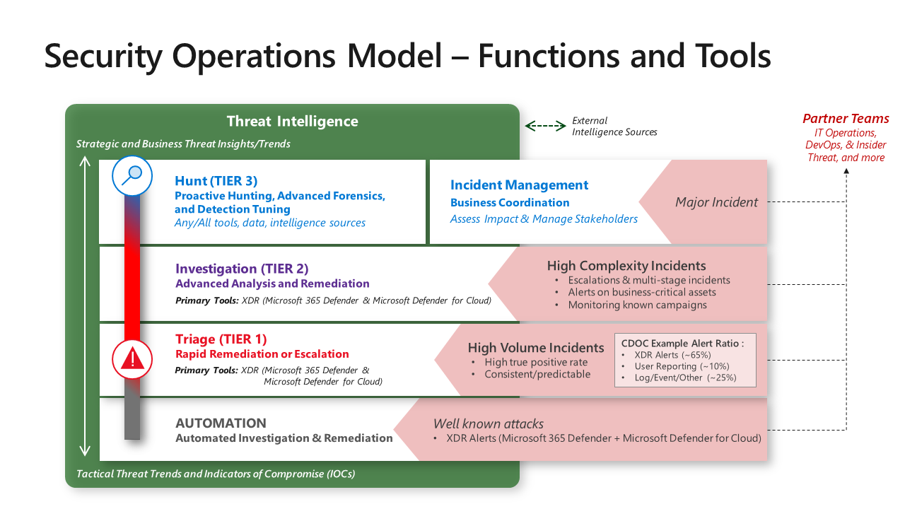

# What is Defender XDR (Extended Detection and Response)
* It is an integrated threat protection suite with solutions that detect malicious activity across
  * Email
  *  Endpoints
  *  Applications
  *  Identity
 
* 
***
# 1. Detection of threat
* 
* Malicious email (on a system not protected by Microsoft Defender for Office 365) or USB drive --> Attachment opened --> Computer infected by the malware 
* Microsoft Defender for Endpoints (MDE) detected this attack -->
* Raises an alert to security operations --> Disables user access from device while infected -->
* And also MDE communicates to Intune that the risk level on this endpoint has changed -->
* An Intune compliance policy configured with an MDE risk level severity is triggered and marks the account as non-compliant with organization's policies
* The conditional access created in Microsoft Entra ID blocks user access to apps.

### What is an endpoint
* An "endpoint" refers to a computing device or node that serves as a point of access to a network.
* Endpoints can include desktop computers, laptops, servers, mobile devices, and even IoT (Internet of Things) devices like smart appliances and sensors.

# 2. Access restricted
* Conditional Access knows about device risk because Microsoft Defender for Endpoint (MDE) notified Intune -->
* which then updated the compliance status of the device in Microsoft Entra ID.
* During this time the user access is restricted.
* What does this access restriction applies to:
  *  All new resource requests
  *  Any current access to resources that support Continuous Acces Evaluation (CAE)
 
* However the restricted user will be able to do tasks like:
  * Internal productivity tasks like research YouTube, Wikipedia, etc that doesn't require corporate authentication and won' thave access to corporate resources.

# 3. Remediation
* Remediation is done by MDE via:
  * Automated remediation
  * Approval of security analyst for automated remediation
  * Manual investigation of threat
 
* MDE also remediates the current threat 1. across our enterprise and 2. across the Microsoft MDE customers by -->
  * Adding information on this attack to Microsoft Threat Intelligence system.
  * Also remediate Threat Variants in MDO and others
 
* 
 
# 4. Restore access
* Once the infected devices are remediated, MDE signals Intune to change the device risk status by updating Microsoft Entra ID -->
* Microsoft Entra ID Conditional Access allows access to enterprise resources.

# 5. Share intelligence
* The threat signals in Microsoft Threat Intelligence are used by Microsoft tools securing other parts of your organization's attack surface.
* **Threat Intelligence teams** provide context and insights to support all other functions (using a threat intelligence platform (TIP) in larger organizations).
* This could include many different facets including
  * Reactive technical research for active incidents
  * Proactive technical research into attacker groups, attack trends, high profile attacks, emerging techniques, etc.
  * Strategic analysis, research, and insights to inform business and technical processes and priorities.
  * And more

***

# Microsoft Defender XDR in a Security Operations Center (SOC)
* This is how XDR and Sentinel are integrated in SOC:
* 

# Security Operations Model
* 

## 1. Automation and Triage (Tier 1)
* We'll start with handling reactive alerts – which begins with:

### Automation
* Near real-time resolution of known incident types with automation. These are well-defined attacks that the organization has seen many times.

### Triage (aka Tier 1)
* Triage analysts focus on rapid remediation of a high volume of well-known incident types that still require (quick) human judgment.
* These are often tasked with approving automated remediation workflows and identifying anything anomalous or interesting that warrant escalation or consultation with investigation (Tier 2) teams.

### Key learnings for Triage and Automation:

* **90% true positive** - We recommend setting a quality standard of 90% true positive for any alert feeds that require an analyst to respond so analysts aren’t required to respond to a high volume of false alarms.
* **Alert Ratio** – In Microsoft’s experience from our Cyber Defense Operations Center, XDR alerts produce most of the high-quality alerts, with the remainders coming from user reported issues, classic log query based alerts, and other sources
* **Automation** is a key enabler for triage teams as it helps empower these analysts and reduce the burden of manual effort (for example, provide automated investigation and then prompt them for a human review before approving the remediation sequence that was automatically built for this incident).
* **Tool Integration** - One of the most powerful time saving technologies that improved time to remediation in Microsoft’s CDOC is the integration of XDR tools together into Microsoft Defender XDR so analysts have a single console for endpoint, email, identity, and more. This integration enables analysts to rapidly discover and clean up attacker phishing emails, malware, and compromised accounts before they can do significant damage.
* **Focus** - These teams can't maintain their high speed of resolution for all types of technologies and scenarios, so they keep their focus narrow on a few technical areas and/or scenarios. Most often this is on user productivity, like email, endpoint AV alerts (versus EDR that goes into investigations), and first response for user reports.

## 2. Investigation and Incident Management (Tier 2)
* This team serves as the escalation point for issues from Triage (Tier 1)
* Proactively, this team also periodically reviews the Triage team alert queue and can proactively hunt using XDR tools in their spare time.
* This team pilots new/unfamiliar alert types to document processes for Triage team and automation, often including alerts generated by Microsoft Defender for Cloud on cloud hosted apps, VMs, containers and Kubernetes, SQL databases, etc.

## 3. Hunt and Incident Management (Tier 3)
* This team proactively hunts for undetected threats, assists with escalations and advanced forensics for reactive investigations, and refines alerts/automation.
* These teams operate in more of a hypothesis-driven model than a reactive alert model and are also where red/purple teams connect with security operations.

# How It Comes Together
* To give you an idea of how this works, let’s follow a common incident lifecycle

1. **Triage (Tier 1)** analyst claims a malware alert from the queue and investigates (for example, with Microsoft Defender XDR console)
2. While most Triage cases are rapidly remediated and closed, this time the analyst observes that malware might require more involved/advanced remediation (for example, device isolation and cleanup). Triage escalates the case to the Investigation analyst (Tier 2), who takes lead for investigation. The Triage team has option to stay involved and learn more (Investigation team might use Microsoft Sentinel or another SIEM for broader context)
3. **Investigation** verifies investigation conclusions (or digs further into it) and proceeds with remediation, closes case.
4. Later, **Hunt (Tier 3)** might notice this case while reviewing closed incidents to scan for commonalities or anomalies worth digging into:
      * Detections that might be eligible for autoremediation
      * Multiple similar incidents that might have a common root cause
      * Other potential process/tool/alert improvements In one case, Tier 3 reviewed the case and found that the user had fallen for a tech scam. This detection was then flagged as a potentially higher priority alert because the scammers had managed to get admin level access on the endpoint. A higher risk exposure.
  

# Practical: Investigate using XDR
* Sentinel --> "Incidents" --> this will list all the incidents in our environment whether those are the incidents created by differet products like Sentinel, 365 defender or Azure Defender, etc.
* Click the incident you want to work on
* When we click on it, on the right-side, there will be a column having link to "Investigate in Azure Defender" in it.
* This link is to see if there is any immediate action that needs to be taken to protect the organization.

* Inside this window, expand the Related Entities:
 * "Azure resource":
   * Here we can see the resource ID of the affected storage account.
  
 * "File"
   * Here we an see the details of the potential malware file that was detected in the storage account.
  
 * "Malware"
   * Here we might see the name of the malware that was detected in the scanned file.
   * Azure Defender was able to detect this file because it used a known bad hash.
  
 * Now go to "Next Step" to see what actions can be taken by an administrator.
 * Click on one fo the recommendations under "Prevent future attacks" --> "Remediation steps" --> Review by clicking "Quick fix logic"
 * This script , in this case, disallows public access to the storage account.
 * to implement this fix, click "Fix" --> "Fix 1 resource"
 * ***
 * Earlier we performed the suggested actions that could eb taken to fix the future attacks, but we can also investigate further:
 * Go back to Sentinel --> "Incidents" --> Click the incident to be investigated --> "Investigate"
 * Investigation graph will open
 * Click "Linked Malicious", if there's one to see its details
 * Here it will give us options to "View playbook" which can be used to share these additional hashes that were used in the malware as custom threat intelligence indicators.
 * On the next screen, when executed by clicking "Run", it will share the new file hashes with Microsoft 365 Defender, enabling Defender to detect the presence of these hashes on machines within our network.
***
 * Now return to the "Incidents" page to figur eout how an attacker gained acces to our environment.
 * Look for the incident saying something about initial access or credential access. click on this incident -->
 * Let's take ownership before investigating it --> by clicking on the "Owner" drop-down on the right --> assign to yourself --> "Apply"
 * * **Note: Changes made within Sentinel will be reflected automatically with Defender xDR or 365, and vice-versa.
 * We can investigate this incident in Sentinel but Defender XDR or 365 enables deep analysis of endpoint exploitation. So we will open " Investigate in Microsoft 365 Defender"
 * Here on this page, click "Manage Incident" to confirm that change we made in Sentinel was synchronized --> this should tell us that the incident was assigned to our account --> "Cancel"
 * Now, to establish how the attacker gained access to a machine on our network, let's investigate the alerts related to this incident by clicking  --> "Alerts" tab at the top.
 * Click on the suspicious alert to expand it.
 * this will show the details. In this case it showed that Microsoft Word was used to open an attached file which probably arrived in a spear phishing email.
 * Now return to Sentinel to investigate if the files used in this attack were associated to any other attacks on our network.
 * Go back to sentinel --> "Investigate"
 * Click "Subscription Activity" on the graph
 * Eg: The query results show that attacker used the user account to view Blob storage keys. --?
 * The attacker then used the keys to upload files to our blob storage, likely for use in future campaigns.

 ***
 * Let's see which actions were taken in response to this incident --> Sentinel --> Click the incident
 * On the right, we can scroll down and see the comments added to the incident.
 * Here we can also find the automation rule that triggered the action --> Click the rule to see the logic of this rule in "Automation"
 * When an incident is created, the rule checks if any analytic files have tactics containing credential access and if the incident provider was Microsoft 365 Defender.
 * If so the playbook will  execute to block the Azure AD user.
***
# QUIZ

1. Which Microsoft Defender XDR solution can detect an Active Directory Domain compromise? 

Microsoft Defender for Identity
Correct. Domain compromise is detected with Microsoft Defender for Identity.

2. Which Microsoft Defender XDR solution can detect a phishing email? 

Microsoft Defender for Office 365
Correct. Phishing email is detected by Microsoft Defender for Office 365.

3. Which Microsoft Defender XDR solution can detect a malware installation? 

Microsoft Defender for Endpoint
Correct. Malware installation is detected by Microsoft Defender for Endpoint.

       
**Questions**
1. What is Intune?
2. What is Microsoft Entra ID Conditional Access?
* Last revised: 23/02/2024
* Next revision date: 01/03/2024
