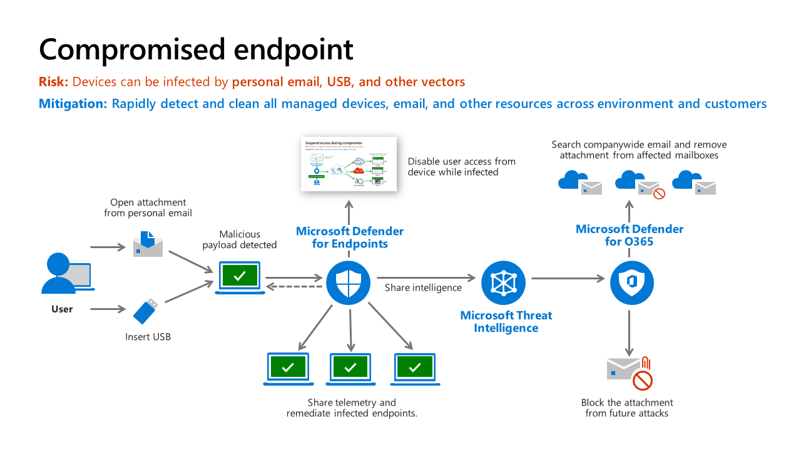

# What is Defender XDR (Extended Detection and Response)
* It is an integrated threat protection suite with solutions that detect malicious activity across
  * Email
  *  Endpoints
  *  Applications
  *  Identity
 
* 
***
# 1. Detection of threat
* 
* Malicious email (on a system not protected by Microsoft Defender for Office 365) or USB drive --> Attachment opened --> Computer infected by the malware 
* Microsoft Defender for Endpoints (MDE) detected this attack -->
* Raises an alert to security operations --> Disables user access from device while infected -->
* And also MDE communicates to Intune that the risk level on this endpoint has changed -->
* An Intune compliance policy configured with an MDE risk level severity is triggered and marks the account as non-compliant with organization's policies
* The conditional access created in Microsoft Entra ID blocks user access to apps.

### What is an endpoint
* An "endpoint" refers to a computing device or node that serves as a point of access to a network.
* Endpoints can include desktop computers, laptops, servers, mobile devices, and even IoT (Internet of Things) devices like smart appliances and sensors.

# 2. Access restricted
* Conditional Access knows about device risk because Microsoft Defender for Endpoint (MDE) notified Intune -->
* which then updated the compliance status of the device in Microsoft Entra ID.
* During this time the user access is restricted.
* What does this access restriction applies to:
  *  All new resource requests
  *  Any current access to resources that support Continuous Acces Evaluation (CAE)
 
* However the restricted user will be able to do tasks like:
  * Internal productivity tasks like research YouTube, Wikipedia, etc that doesn't require corporate authentication and won' thave access to corporate resources.

# 3. Remediation
* Remediation is done by MDE via:
  * Automated remediation
  * Approval of security analyst for automated remediation
  * Manual investigation of threat
 
* MDE also remediates the current threat 1. across our enterprise and 2. across the Microsoft MDE customers by -->
  * Adding information on this attack to Microsoft Threat Intelligence system.
  * Also remediate Threat Variants in MDO and others
 
* 
 
# 4. Restore access
* Once the infected devices are remediated, MDE signals Intune to change the device risk status by updating Microsoft Entra ID -->
* Microsoft Entra ID Conditional Access allows access to enterprise resources.

# 5. Share intelligence
* The threat signals in Microsoft Threat Intelligence are used by Microsoft tools securing other parts of your organization's attack surface.
* **Threat Intelligence teams** provide context and insights to support all other functions (using a threat intelligence platform (TIP) in larger organizations).
* This could include many different facets including
  * Reactive technical research for active incidents
  * Proactive technical research into attacker groups, attack trends, high profile attacks, emerging techniques, etc.
  * Strategic analysis, research, and insights to inform business and technical processes and priorities.
  * And more

***

# Microsoft Defender XDR in a Security Operations Center (SOC)
* This is how XDR and Sentinel are integrated in SOC:
* 

# Security Operations Model
* 

## 1. Automation and Triage (Tier 1)
* We'll start with handling reactive alerts – which begins with:

### Automation
* Near real-time resolution of known incident types with automation. These are well-defined attacks that the organization has seen many times.

### Triage (aka Tier 1)
* Triage analysts focus on rapid remediation of a high volume of well-known incident types that still require (quick) human judgment.
* These are often tasked with approving automated remediation workflows and identifying anything anomalous or interesting that warrant escalation or consultation with investigation (Tier 2) teams.

### Key learnings for Triage and Automation:

* **90% true positive** - We recommend setting a quality standard of 90% true positive for any alert feeds that require an analyst to respond so analysts aren’t required to respond to a high volume of false alarms.
* **Alert Ratio** – In Microsoft’s experience from our Cyber Defense Operations Center, XDR alerts produce most of the high-quality alerts, with the remainders coming from user reported issues, classic log query based alerts, and other sources
* **Automation** is a key enabler for triage teams as it helps empower these analysts and reduce the burden of manual effort (for example, provide automated investigation and then prompt them for a human review before approving the remediation sequence that was automatically built for this incident).
* **Tool Integration** - One of the most powerful time saving technologies that improved time to remediation in Microsoft’s CDOC is the integration of XDR tools together into Microsoft Defender XDR so analysts have a single console for endpoint, email, identity, and more. This integration enables analysts to rapidly discover and clean up attacker phishing emails, malware, and compromised accounts before they can do significant damage.
* **Focus** - These teams can't maintain their high speed of resolution for all types of technologies and scenarios, so they keep their focus narrow on a few technical areas and/or scenarios. Most often this is on user productivity, like email, endpoint AV alerts (versus EDR that goes into investigations), and first response for user reports.

## 2. Investigation and Incident Management (Tier 2)
* This team serves as the escalation point for issues from Triage (Tier 1)
* Proactively, this team also periodically reviews the Triage team alert queue and can proactively hunt using XDR tools in their spare time.
* This team pilots new/unfamiliar alert types to document processes for Triage team and automation, often including alerts generated by Microsoft Defender for Cloud on cloud hosted apps, VMs, containers and Kubernetes, SQL databases, etc.

## 3. Hunt and Incident Management (Tier 3)
* This team proactively hunts for undetected threats, assists with escalations and advanced forensics for reactive investigations, and refines alerts/automation.
* These teams operate in more of a hypothesis-driven model than a reactive alert model and are also where red/purple teams connect with security operations.

# How It Comes Together
* To give you an idea of how this works, let’s follow a common incident lifecycle

1. **Triage (Tier 1)** analyst claims a malware alert from the queue and investigates (for example, with Microsoft Defender XDR console)
2. While most Triage cases are rapidly remediated and closed, this time the analyst observes that malware might require more involved/advanced remediation (for example, device isolation and cleanup). Triage escalates the case to the Investigation analyst (Tier 2), who takes lead for investigation. The Triage team has option to stay involved and learn more (Investigation team might use Microsoft Sentinel or another SIEM for broader context)
3. **Investigation** verifies investigation conclusions (or digs further into it) and proceeds with remediation, closes case.
4. Later, **Hunt (Tier 3)** might notice this case while reviewing closed incidents to scan for commonalities or anomalies worth digging into:
      * Detections that might be eligible for autoremediation
      * Multiple similar incidents that might have a common root cause
      * Other potential process/tool/alert improvements In one case, Tier 3 reviewed the case and found that the user had fallen for a tech scam. This detection was then flagged as a potentially higher priority alert because the scammers had managed to get admin level access on the endpoint. A higher risk exposure.
       
**Questions**
1. What is Intune?
2. What is Microsoft Entra ID Conditional Access?
* Last revised: 23/02/2024
* Next revision date: 01/03/2024
